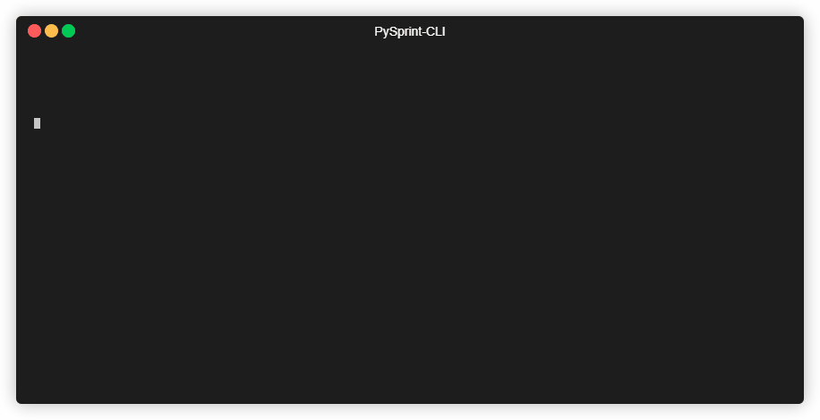

# PySprint-CLI

[](https://ci.appveyor.com/project/Ptrskay3/pysprint-cli)

[](https://travis-ci.com/Ptrskay3/pysprint-cli)


The command line tool for PySprint. It uses an embedded Python interpreter.



### WARNING!

PySprint-CLI is in very early stages of development, you might find bugs or undefined behaviour.

### Usage

First, set up an `eval.yaml` file where you will work. PySprint-CLI will optionally generate a default one on demand. That file will define the behaviour of the program. You can find the full description of parameters [here](#Details-of-the-configuration-file). Here is an example:

```yml
load_options:
  extensions:
    - "trt"
  exclude_patterns:
    - "*?3?.trt"
  skip_files:
    - "my_file_to_skip.txt"
  skiprows: 8
  decimal: ","
  delimiter: ";"
  meta_len: 6
  mod: -1
  no_comment_check: true
preprocess:
  chdomain: true
  input_unit: "nm"
  slice_start: 2
  slice_stop: 4
method: fft
method_details:
  heatmap: false
  windows: 400
  fwhm: 0.05
  parallel: true
before_evaluate:
  - print('before_evaluate')
  - print(f'you have access to the {ifg} variable')
evaluate:
  reference_frequency: 2.355
  order: 3
  only_phase: false
after_evaluate:
  - print('this piece of code will be run after evaluate')
  - print('and after evaluate too..')
```

## SUBCOMMANDS

- _watch_

  This subcommand will watch a filepath for changes, and it immediately reruns on create and change events (a 100 ms throttle is applied).
  Note that `cff` and `spp` methods are not available during watch mode, because it brings ambiguity to the evaluation.

  ```shell
  psc watch [FLAGS] [OPTIONS] <YOUR PATH HERE>
  ```

  Available flags and options:

  - [`config`](#config)
  - [`result`](#result)
  - [`persist`](#persist)
  - [`verbosity`](#verbosity)
  - [`override`](#override)

- _audit_

  This subcommand will run a full evaluation in an existing directory, using the specified `eval.yaml` file.

  ```shell
  psc audit [FLAGS] [OPTIONS] <YOUR PATH HERE>
  ```

  Available flags and options:

  - [`config`](#config)
  - [`result`](#result)
  - [`persist`](#persist)
  - [`verbosity`](#verbosity)
  - [`override`](#override)

- _summarize_

  This subcommand will summarize the evaluation results from a generated `results.json` file.

  ```shell
  psc summarize [FLAGS]
  ```

  Available flags:

  - [`result`](#result)

## FLAGS AND OPTIONS

### config

The config file to use for evaluation. If not specified, a default `eval.yaml` file will be used in the target directory.

Usage:

- `-c my_custom_file.yaml`
- `--config my_custom_file.yaml`

Example:

- ```shell
  psc audit . -c my_custom_file.yaml
  ```

### result

The result file to write the evaluation details. If not specified, a default `results.json` file will be created in the target directory. In case that already exists, the user gets to decide whether to override it.

Usage:

- `-r my_custom_result_file.json`
- `--result my_custom_result_file.json`

Example:

- ```shell
  psc audit . -r my_custom_result_file.json
  ```

### persist

Whether to persist the generated Python code. The generated Python files will be named as `filename_ps.py`, where `filename` is the original name of the evaluated file.

Usage:

- `-p`
- `--persist`

Example:

- ```shell
  psc audit . --persist
  ```

### verbosity

The verbosity level of the result file.

Usage:

- `-v`

Example:

- ```shell
  psc audit . -v
  ```

### override

Whether to override existing files.

Usage:

- `-o`
- `--override`

Example:

- ```shell
  psc audit . --override
  ```

Note: Single letter flags without options can be combined, so it's perfectly fine to write

```shell
psc audit . -opv
```

## Installing

Currently the only available option is to build the software from source. However, work is in progress to increase accessibility.

### Building from source

Make sure you have [Rust](https://www.rust-lang.org/tools/install) and [Python 3.6+](https://www.python.org/downloads/) installed.
You will also need [Build Tools for Visual Studio](https://visualstudio.microsoft.com/downloads/#build-tools-for-visual-studio-2019).

To install locally, navigate to the root directory of the crate, and run:

```shell
cargo install --path .
```

## Details of the configuration file

### `load_options` section

- `extensions`: The file extensions to pick up when collecting. It must be a sequence. In rare cases when the files might not have an extension, use the `"__noextension"` type.

  - Example:

  ```yaml
  load_options:
    extensions:
      - "trt"
      - "txt"
  ```

  - `exclude_patterns`: Special patterns to exclude files. Must be a sequence.
  - Example:

  ```yaml
  load_options:
    exclude_patterns:
      - "*0*" # excludes any file that has a 0 in its filename
      - "*a?a.*" # exclude any file that includes two `a` letters separated by a single character.
  ```

- `skip_files`: Files to skip. Must be a sequence, and must include the extension of the file.

  - Example:

  ```yaml
  load_options:
    skip_files:
      - "myfile.txt"
      - "my_another_file_to_skip.psd"
  ```

- `skiprows`: The number of lines to skip in each loaded file. It's equivalent to `pysprint.Dataset.parse_raw`'s skiprows option (and internalls calls that too). Must be a non-negative integer.

  - Example:

  ```yaml
  load_options:
    skiprows: 15
  ```

- `decimal`: The character recognized as decimal serparator in the loaded file. Must be a single character.

  - Example:

  ```yaml
  load_options:
    decimal: ","
  ```

- `delimiter`: The character recognized as the delimiter in the loaded file. Must be a single character.

  - Example:

  ```yaml
  load_options:
    delimiter: ";"
  ```

- `meta_len`: The length of the meta information at the top of the file. It's parsed by `pysprint.Dataset.parse_raw`. Must be a non-negative integer.

  - Example:

  ```yaml
  load_options:
    meta_len: 15
  ```

- `mod`: The modulus to sort files by. It must be 1, 3 or -1. Picking 3 will sort files by arms' spectra for efficient and quick normalization. Picking -1 will do the same, but simply skips normalization (basically acts as if the arms' weren't there).

  - Example:

  ```yaml
  load_options:
    mod: -1
  ```

- `no_comment_check`: Whether to check each file for special keywords in their metadata, and skip evaluation of presence. These keywords are `sam`, `ref`, `sample`, `reference` and `noeval`. Must be `true` or `false`.

  - Example:

  ```yaml
  load_options:
    no_comment_check: true
  ```

### `preprocess` section

- `chdomain`: Whether to change domain on the loaded files. Must be `true` or `false`.

  - Example:

  ```yaml
  preprocess:
    chdomain: false
  ```

- `input_unit`: The input units of the loaded file. Conversions will be made accordingly. Defaults to `"nm"`.

  - Example:

  ```yaml
  preprocess:
    input_unit: "um"
  ```

- `slice_start`: Values below this number will be discarded in the domain of the interferogram. It's in PHz units.

  - Example:

  ```yaml
  preprocess:
    slice_start: 3 # PHz
  ```

- `slice_stop`: Values greater than this number will be discarded in the domain of the interferogram. It's in PHz units.

  - Example:

  ```yaml
  preprocess:
    slice_stop: 4.5 # PHz
  ```

### `method` section

The method to use for evaluation. Must be `fft`, `wft`, `mm`, `spp` or `cff`.

- Example:

```yaml
method: fft
```

### `method_details` section

#### Globally available options

- `plot`: Whether to show the inteferogram before running evaluate. It stops execution until the window is closed. Must be `true` or `false`.

  - Example:

  ```yaml
  method_details:
    plot: true
  ```

#### Options for `wft`

- `heatmap`: Whether to show the heatmap after evaluate. It stops execution until the window is closed. Must be `true` or `false`.

  - Example:

  ```yaml
  method_details:
    heatmap: true
  ```

- `windows`: The number of windows to apply on the interferogram.
  For more information, see the [`Pysprint Guide`](https://pysprint.readthedocs.io/en/latest/hu_wft.html).

  - Example:

  ```yaml
  method_details:
    windows: 400
  ```

- `fwhm`: The Full Width at Half Max of the window function. It's in PHz units. For more information, see the [`Pysprint Guide`](https://pysprint.readthedocs.io/en/latest/hu_wft.html).

  - Example:

  ```yaml
  method_details:
    fwhm: 0.05
  ```

- `std`: The Standard Deviation of the window function. It's in PHz units. For more information, see the [`Pysprint Guide`](https://pysprint.readthedocs.io/en/latest/hu_wft.html).

  - Example:

  ```yaml
  method_details:
    std: 0.05
  ```

- `parallel`: Whether to run parallel execution. The [Dask](https://dask.org/) Python package must be installed. For more information, see the [`Pysprint Guide`](https://pysprint.readthedocs.io/en/latest/hu_wft.html).

  - Example:

  ```yaml
  method_details:
    parallel: true
  ```

#### Options for `mm`

- `min`: Whether to use the minimums for the evaluation. Must be `true` or `false`.

  - Example:

  ```yaml
  method_details:
    min: true
  ```

- `max`: Whether to use the maximums for the evaluation. Must be `true` or `false`.

  - Example:

  ```yaml
  method_details:
    max: true
  ```

- `both`: Whether to use the both maximums and minimums for the evaluation. Must be `true` or `false`.

  - Example:

  ```yaml
  method_details:
    both: true
  ```

- `detach`: Whether to open the interactive extremal point editor window. Must be `true` or `false`.

  - Example:

  ```yaml
  method_details:
    detach: true
  ```

#### Options for `spp`

- `eager`: Whether to trigger a calculation on every SPP recording.

  - Example:

  ```yaml
  method_details:
    eager: true
  ```

- `detach`: Whether to open the interactive SPP editor window. Must be `true` or `false`.

  - Example:

  ```yaml
  method_details:
    detach: true
  ```

### `before_evaluate` and `after_evaluate` section

These sections are special ways to interact with the generated code. The contents of these fields (in case it's valid Python code) will be inserted before and after evaluate.

- Example:

```yaml
before_evaluate:
  - print("this will be printed")

after_evaluate:
  - print(f"also you have the {ifg} variable available")
```

### `evaluate` section

- `reference_frequency`: The reference frequency to use for evaluation. Must be in units of PHz.

  - Example:

  ```yaml
  evaluate:
    reference_frequency: 2.355
  ```

- `order`: The maximum order of disperion to look for. Must be an integer in [2, 6].

  - Example:

  ```yaml
  evaluate:
    order: 4
  ```

_The feature below currently not implemented, but work is being done._

- `only_phase`: Retrieve only the phase without fitting a curve and evaluating. Must be `true` or `false`.

  - Example:

  ```yaml
  evaluate:
    only_phase: true
  ```
